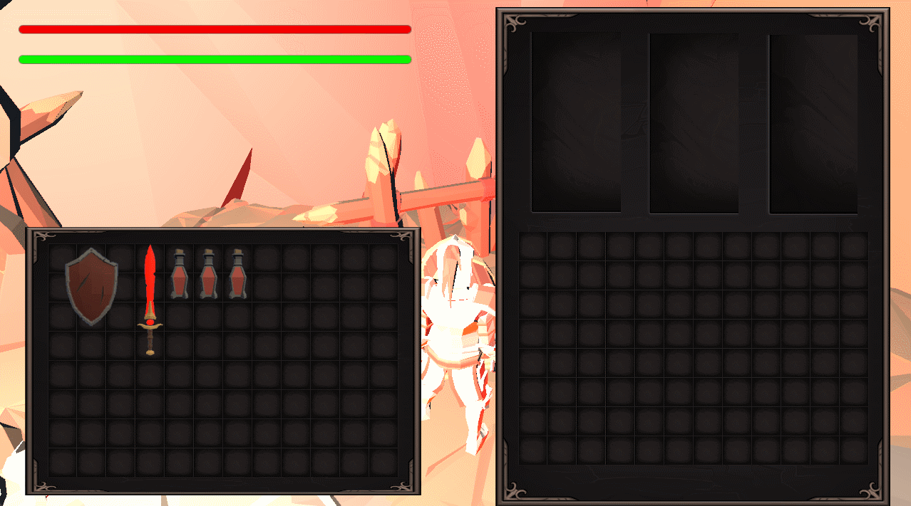

# LightSoul

* 개발환경 : Unity , C#

* DownloadLink : 
## 조작법

* W,A,S,D - 이동
* Q - LockOn
* F  - 상호작용
* SpaceBar - 구르기
* Shift - 달리기

## InvetorySystem
* 그리드 인벤토리를 아이템을 정리하여 배치 할 수 있도록 구현하였습니다.
<details>
<summary> Inventory Grid 코드샘플</summary>
  
```cs
    //아이템이 그리드 내에 있는지 확인하기위한 메서드
    private bool PositionChk(int x, int y)
    {
        if (x < 0 || y < 0) return false;
        if (x >= gridSizeWidth || y >= gridSizeHeight) return false;
        return true;
    }

    //그리드의 위치를 찾기위한 메서드
    public Vector2Int GetTileGridPosition(Vector2 mousePosition)
    {  
        positionOnTheGrid.x = mousePosition.x - rectTransform.position.x;
        positionOnTheGrid.y = rectTransform.position.y - mousePosition.y;

        tileGridPosition.x = (int)(positionOnTheGrid.x / (tileWidth * rootCanvas.scaleFactor));
        tileGridPosition.y = (int)(positionOnTheGrid.y / (tileHeight * rootCanvas.scaleFactor));

        return tileGridPosition;
    }

    //아이템을 해당하는 위치에 넣기위해 확인 후 넣는 메서드
    public bool PlaceItemWithCheck(InventoryItem item , int posX, int posY, ref InventoryItem overlapItem)
    {

        if (!BoundaryCheck(posX, posY, item.WIDTH, item.HEIGHT))
            return false;

        if (!OverlapCheck(posX, posY, item.WIDTH, item.HEIGHT, ref overlapItem))
        {
            overlapItem = null;
            return false;

        }

        if (overlapItem != null)
        {
            CleanGridRef(overlapItem);
        }

       
        PlaceItem(item, posX, posY,true);
        return true;
    }

    public void PlaceItem(InventoryItem item, int posX, int posY,bool playSound)
    {
        if(playSound)
            SoundManager.Instance.PlaySFXSound("Sound/Inventory_Open_00");
        if (item.ItemData.itemType == ITEMTYPE.POTION && itemSlotType == ITEMTYPE.NONE)
        {            /////ui에 포션 갯수정보 추가
            EventManager.Instance.PotionTriggerAction("GET");
        }
        RectTransform rectTransform = item.GetComponent<RectTransform>();
        rectTransform.SetParent(this.rectTransform);

        for (int x = 0; x < item.WIDTH; ++x)
        {
            for (int y = 0; y < item.HEIGHT; ++y)
            {
                InventoryItemsSlot[posX + x, posY + y] = item;
            }
        }

        item.OnGridPosX = posX;
        item.OnGridPosY = posY;

        Vector2 position = ComputePositionGrid(item, posX, posY);

        rectTransform.localPosition = position;
    }

    //그리드 위치를 계산하기 위한 메서드
    public Vector2 ComputePositionGrid(InventoryItem item, int posX, int posY)
    {
        Vector2 position = new Vector2();
        position.x = (posX * tileWidth + tileWidth / 2 * item.WIDTH) * ratio;
        position.y = -(posY * tileHeight + tileHeight / 2 * item.HEIGHT) * ratio;
        return position;
    }

    //해당하는 위치에 아이템이 있는지 확인하는 메서드
    private bool OverlapCheck(int posX, int posY, int width, int height, ref InventoryItem overlapItem)
    {
        for(int x = 0; x < width;++x)
        {
            for (int y = 0; y < height; ++y)
            {
                if (InventoryItemsSlot[posX + x, posY + y] != null)
                {
                    if (overlapItem == null)
                    {
                        overlapItem = InventoryItemsSlot[posX + x, posY + y];
                    }
                    else
                    {
                        if(overlapItem != InventoryItemsSlot[posX + x, posY + y])
                            return false;
                    }
                }
            }
        }

        return true;
    }
    //해당하는 위치가 비어있는지 확인하는 메서드
    private bool CheckAvailableSpace(int posX, int posY, int width, int height)
    {
        for (int x = 0; x < width; ++x)
        {
            for (int y = 0; y < height; ++y)
            {
                if (InventoryItemsSlot[posX + x, posY + y] != null)
                {
                    return false;
                }
            }
        }

        return true;
    }
    //인벤토리에서 아이템을 픽업하는 메서드
    internal InventoryItem PickUpItem(int x, int y)
    {
        if (x < 0 || y < 0 || x >= gridSizeWidth || y >=gridSizeHeight ) return null;
        InventoryItem ret = InventoryItemsSlot[x, y];

        if (ret == null) return null;

        CleanGridRef(ret);

        return ret;
    }
    //픽업 한 후 아이템을 그리드에서 비워주기 위한 메서드
    private void CleanGridRef(InventoryItem item)
    {
        for (int ix = 0; ix < item.WIDTH; ++ix)
        {
            for (int iy = 0; iy < item.HEIGHT; ++iy)
            {
                InventoryItemsSlot[item.OnGridPosX + ix, item.OnGridPosY + iy] = null;
            }
        }
    }

    //아이템이 그리드 내에 있는지 확인하기 위한 메서드
    public bool BoundaryCheck(int x, int y,int width,int height)
    {
        if(PositionChk(x,y)==false) return false;

        x += width-1;
        y += height-1;

        if(PositionChk(x,y) == false) return false;

        return true;
    }

    internal InventoryItem GetItem(int x, int y)
    {
        if (x < 0 || y < 0 || x >= gridSizeWidth || y >= gridSizeHeight) return null;

        return InventoryItemsSlot[x,y];
    }

    //그리드에 아이템을 넣을때 공간을 찾는 메서드
    //시작시 상자에 아이템을 넣거나 랜덤아이템을 넣을 때 사용
    public Vector2Int? FindSapceForItem(InventoryItem item)
    {
        int height = gridSizeHeight - item.HEIGHT + 1;
        int width = gridSizeWidth - item.WIDTH + 1;
        for (int y = 0; y < height; y++) 
        {
            for (int x = 0; x < width; x++)
            {
                if(CheckAvailableSpace(x,y,item.WIDTH,item.HEIGHT))
                {
                    return new Vector2Int(x, y);
                }
            }
        }

        return null;
    }
    
    //아이템을 그리드에 넣기위해 사용하는 메서드
    public void InsertItem(int num)
    {
        var itemPrefab = Resources.Load("Item");
        InventoryItem item = Instantiate(itemPrefab).GetComponent<InventoryItem>();
        item.Set(DataManager.Instance.dicItemDatas[num], canvasScale);

        Vector2Int? posOnGrid = FindSapceForItem(item);

        if (posOnGrid == null) return ;

        PlaceItem(item, posOnGrid.Value.x, posOnGrid.Value.y,false);

    }
}

```

</details>

 <details>
   
<summary> Inventory Controller 코드샘플</summary>
  
```cs
 
    //그리드의 위치를 구하기 위한 메서드
    private Vector2Int GetTileGridPosition()
    {
        Vector2 position = Input.mousePosition;
        if (selectedItem != null)
        {
            position.x -= (selectedItem.WIDTH - 1) * InvectoryGrid.tileWidth * selectedItemGrid.rootCanvas.scaleFactor / 2;
            position.y += (selectedItem.HEIGHT - 1) * InvectoryGrid.tileHeight * selectedItemGrid.rootCanvas.scaleFactor / 2;
        }

        return selectedItemGrid.GetTileGridPosition(position);
    }

    //아이템을 그리드에 위치시키는 메서드
    private void PlaceItem(Vector2Int positionOnGrid)
    {
        if (IsDropItem)
        {
            /// <summary>
            /// Deprecated
            /// Change to ThridPersonView from TopView
            /// </summary>
            //var Item = Instantiate(DropItem);
            //Ray ray = Camera.main.ScreenPointToRay(Input.mousePosition);
            //RaycastHit hit;
            //if (Physics.Raycast(ray, out hit))
            //{
            //    Item.Init(selectedItem.ItemData);
            //    Item.transform.position = hit.point;

            //}
            //Destroy(selectedItem.gameObject);
            //selectedItem = null;
        }
        else
        {
            if (SelctedEquipmentSlot != null)
            {
                bool chk = SelctedEquipmentSlot.EquipItem(selectedItem, ref overlapItem);
                if (chk)
                {
                    selectedItem = null;
                    if (overlapItem != null)
                    {
                        selectedItem = overlapItem;
                        overlapItem = null;
                        rectTransform = selectedItem.GetComponent<RectTransform>();
                        rectTransform.SetAsLastSibling();
                    }
                }
            }
            else if (selectedItemGrid != null)
            {
                bool chk = selectedItemGrid.PlaceItemWithCheck(selectedItem, positionOnGrid.x, positionOnGrid.y, ref overlapItem);
                if (chk)
                {
                    selectedItem = null;
                    if (overlapItem != null)
                    {
                        selectedItem = overlapItem;
                        overlapItem = null;
                        rectTransform = selectedItem.GetComponent<RectTransform>();
                        rectTransform.SetAsLastSibling();
                    }
                }
            }

        }

    }

    //그리드에서 아이템을 픽업하기 위한 메서드
    private void ItemPickup(Vector2Int positionOnGrid)
    {
        if (SelctedEquipmentSlot != null)
        {
            selectedItem = SelctedEquipmentSlot.PickUpItem();
        }
        else if (selectedItemGrid != null)
        {
            selectedItem = selectedItemGrid.PickUpItem(positionOnGrid.x, positionOnGrid.y);

        }
        if (selectedItem != null)
        {
            if (selectedItem.ItemData.itemType == ITEMTYPE.POTION && selectedItemGrid.ItemSlotType == ITEMTYPE.NONE)
            {
                EventManager.Instance.PotionTriggerAction("DROP");
                /////ui에 포션 갯수정보 추가
            }
            rectTransform = selectedItem.GetComponent<RectTransform>();

        }
    }
    //픽업한 아이템의 아이콘을 마우스와 같이 이동하도록 하는 메서드
    private void DragItemIcon()
    {
        if (selectedItem != null)
        {
            rectTransform.position = Input.mousePosition;
        }
    }

    //그리드에 아이템을 넣을 위치에 하이라이트 표시를 위한 메서드
    private void HandleHighLight()
    {
        Vector2Int positionOnGrid = GetTileGridPosition();
        if (oldPosition == positionOnGrid) return;

        oldPosition = positionOnGrid;

        if ( selectedItem == null)
        {
            itemToHighLight = selectedItemGrid.GetItem(positionOnGrid.x, positionOnGrid.y);
            if(itemToHighLight!=null)
            {
                inventoryHighLight.HighLight(true);
                inventoryHighLight.SetSize(itemToHighLight);
                inventoryHighLight.SetPosition(selectedItemGrid, itemToHighLight);
            }
            else
            {
                inventoryHighLight.HighLight(false);
            }

        }
        else
        {
            inventoryHighLight.HighLight(selectedItemGrid.BoundaryCheck(
                positionOnGrid.x,
                positionOnGrid.y,
                selectedItem.WIDTH,
                selectedItem.HEIGHT)
                );
            inventoryHighLight.SetSize(selectedItem);
            inventoryHighLight.SetPosition(selectedItemGrid, selectedItem, positionOnGrid.x,positionOnGrid.y);
        }
    }
}

```

</details>



## LockOn System

* 카메라가 가장 가까운 몬스터를 바라보게 LockOn을 구현하였습니다.

<details>
<summary> LockOn Script 코드샘플</summary>
  
```cs
    private void OnTriggerEnter(Collider other)
    {
        if (other.CompareTag("Monster"))
        {
            targets.Add(other.transform);
        }
    }
    private void OnTriggerStay(Collider other)
    {
        if (other.CompareTag("Monster"))
        {
            Vector3 dirToTarget = (other.transform.position - transform.position).normalized;
            if (Vector3.Angle(transform.forward, dirToTarget) < viewAngle / 2)
            {
                UpdateNearMonster();
            }

        }
    }
    private void OnTriggerExit(Collider other)
    {
        if (other.CompareTag("Monster"))
        {
            if (other.transform.Equals(target.transform))
            {
                character.IsLockOn=false;
                target = null;
            }
               
            targets.Remove(other.transform);
        }

    }

    //플레이어 주변의 몬스터 갱신
    private void UpdateNearMonster()
    {
        float closestDist = viewRadius * viewRadius;

        foreach (Transform targetMonster in targets)
        {
            if (targetMonster == null) continue;
            //fake null 확인
            float dist = (targetMonster.position - transform.position).sqrMagnitude;

            if (dist < closestDist)
            {
                closestDist = dist;
                target = targetMonster.GetComponent<Monster>();
            }
        }
    }
    public void RemoveTarget(Transform target)
    {
        targets.Remove(target);
    }
}
```

</details>

<details>
  
<summary> PlayerCharacter Script 코드샘플</summary>
  
```cs

private void LockOn()
{
    if (IsLockOn)
    {
        if (lockOn.Target.IsDead)
        {
            animator.SetBool("LockOn", false);
            IsLockOn = false;
            lockOn.RemoveTarget(lockOn.Target.transform);
            lockOn.Target = null;
            lockOnUI.gameObject.SetActive(false);
        }
        else
        {
            var dir = lockOn.Target.transform.position - transform.position;
            dir.y = 0;
            RotateToTarget(lockOn.Target.transform, false);
            lockOnUI.transform.position = lockOn.Target.LockOnPosition;
        }
    }
}

 public void OnLockOn(InputAction.CallbackContext value)
 {
     if (value.performed)
     {
         if (lockOn.Target == null)
             return;

         if(!IsLockOn)
         {
             ToggleTargetLock(!IsLockOn);
         }
         else
         {
             ToggleTargetLock(!IsLockOn);
         }
     }
 }

```

</details>

<details>
  
<summary> FollowCamera Script 코드샘플</summary>
  
```cs

    public void UpdateWork()
    {

        if (!isUIActive)
        {
            CheckObstruct();

            if (player.IsLockOn)
                TargetLook(lockOn.Target.LockOnPosition);
            else
                CameraLook();
        }
    }
    public void LateUpdateWork() { }

    //Lockon 되었을 때 타겟을 향해 카메라를 고정하는 메서드
    private void TargetLook(Vector3 target)
    {
        Vector3 direction = target - camPos.position;
        Quaternion targetRotation = Quaternion.LookRotation(direction);
        camPos.rotation = Quaternion.Slerp(camPos.rotation, targetRotation, cameraSensitive * Time.deltaTime);
    }

```

</details>


## Parring System

* 방패를 이용한 Parring System을 구현하여 성공 시 강한 공격을 할 수 있도록 구현하였습니다.

  <details>
<summary> PlayerAttack 코드샘플</summary>
  
```cs

//마우스 입력이 가드인지 패링인지 확인
private void GuardAndParring()
{
    if (inputContition.performed)
    {
        rightButtunHoldTime += Time.deltaTime;
    }
    if (guardTrigger)
    {
        //마우스 입력이 단발성인 경우 패링모션
        if (!IsGuard)
            animator.SetTrigger("Parring");
        else
            ChangeGuardState();
        guardTrigger = false;
        rightButtunHoldTime = 0.0f;
    }
    //홀드상태면 가드
    if (!IsGuard && rightButtunholdThreshold <= rightButtunHoldTime)
    {
        ChangeGuardState();
    }
}

```

</details>

<details>
<summary> Inventory Grid 코드샘플</summary>
  
```cs

    private void OnTriggerEnter(Collider other)
    {
        if (this.CompareTag("Weapon"))
        {
            if (other.gameObject.CompareTag("Monster"))
            {
                var monster = other.GetComponentInChildren<Monster>();
                if (monster.IsStunned)
                {
                    monster.TakeDamage(itemData.damage * 3);
                }
                else
                {
                    monster.TakeDamage(itemData.damage);
                }
                HitEffect(other);

                //몬스터가 뒤돌아보고 있는 경우 플레이어 쪽으로 회전시키게
                if (monster.MonsterRangeChecker.Target == null)
                    monster.RotateToTarget(transform, true);
            }
        }
        else if (this.CompareTag("Shield"))
        {
            //플레이어의 방패와 몬스터의 공격이 맞닿으면 패링처리
            if (other.gameObject.CompareTag("MonsterWeapon") && !playerCharacter.IsHit)
            {
                HitEffect(other);
                ///sound
                SoundManager.Instance.PlaySFXSound("Sound/HammerImpact12");
                var monster = other.GetComponentInParent<Monster>();
                monster.IsStunned = true;
                monster.Animator.SetTrigger("Stunned");
                playerAttack.TargetMonster = monster;
            }
        }
    }

```

</details>


